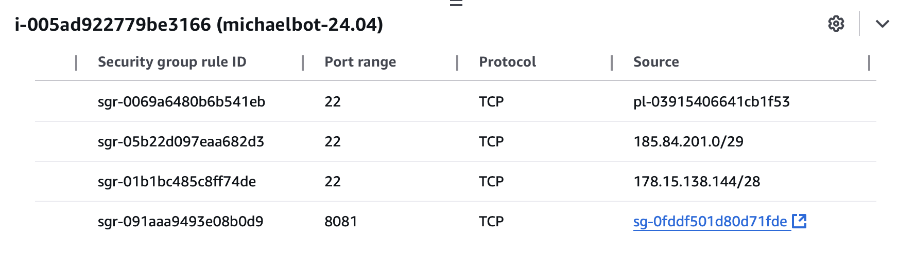
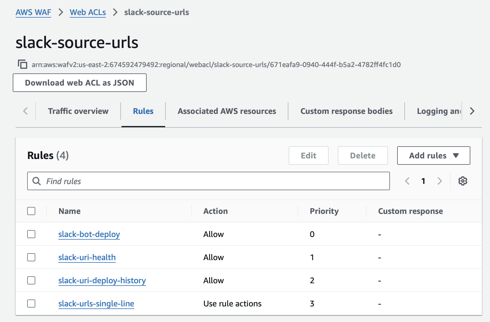

Michael
=======

[](https://travis-ci.org/andrewslotin/michael)

Announce deploys in Slack channels.

Slack app: https://api.slack.com/apps/A08KWH8PJCC/general

Instance Setup 
--------------
The instance is created on AWS backend account in region us-east-2 (Ohio). This instance has a public IP and is accessible through SSH using public/private key pairs. 

The access is limited to Adjust VPN (Office) and New Bastion IPs. It is also possible to use EC2 Instance Connect from AWS Web Console. Security settings can be seen in Security Group (sg-0f4aaed99c0e4f992). 



The web port open is 8081 and it can only be accessed through AWS Elastic Load Balancer (ALB) through https://adjust-michaelbot.de

It is also protected via AWS Web Application Firewall (WAF). There are three ALLOW rules created for each handler to send requests from Slack; "/deploy", "/health" and "/C0T3QJQRX" for history. 

The last rule is "BLOCK" rule and if the "Origin" header is not coming from [Slack DNS entries](https://adjust.slack.com/help/urls) At the moment it only acts as a DENY rule since Slack requests have no "Referer" or "Origin" headers. If they add them, and we can verify the header matches the Source IP, then this Block rule will be very helpful. Otherwise it acts as "Deny all" if request is not made to the allowed handlers. 



Micaelbot runs as a systemd service with the following details:
- Service unit file: `/etc/systemd/system/michaelbot.service`
```
[Unit]
Description=MichaelBot Go Application
After=network.target

[Service]
Type=simple
User=ubuntu
WorkingDirectory=/home/ubuntu/michaelbot
ExecStart=/home/ubuntu/michaelbot/michaelbot
Restart=on-failure
RestartSec=10s

# Environment variables
EnvironmentFile=/etc/default/michaelbot

# Logging
StandardOutput=journal
StandardError=journal
SyslogIdentifier=michaelbot

[Install]
WantedBy=multi-user.target
```
- Environment variables configuration: `/etc/default/michaelbot`
```
SLACK_WEBAPI_TOKEN=****
SLACK_SIGNING_SECRET=****
GITHUB_TOKEN=****
BOLTDB_PATH=****
```
How to update MichaelBot
------------------------

```
ssh ubuntu@PUBLIC_IP
cd michaelbot
git pull
git checkout master (or a feature branch)
go build -o michaelbot .
sudo systemctl restart michaelbot.service
```

### Management Commands

To check Michaelbot status:
```
sudo systemctl status michaelbot.service
```

To restart Michaelbot:
```
sudo systemctl restart michaelbot.service
```

To check Michaelbot logs:
```
sudo journalctl -u michaelbot.service
```

Environment Variables
--------------------

The following environment variables are used to configure the application:

| Variable | Description |
|----------|-------------|
| `SLACK_SIGNING_SECRET` | Required for authenticating requests from Slack. Find it in your Slack App configuration under "Basic Information" > "Signing Secret". |
| `GITHUB_TOKEN` | GitHub personal access token with `repo` permissions to fetch PR details (title, description, author). Without this token, only public PRs will show detailed information. |
| `SLACK_WEBAPI_TOKEN` | Slack Web API token used for channel topic management and direct message notifications. Required for deploy status in channel topic and user mention notifications. |
| `BOLTDB_PATH` | Path to the BoltDB file for persistent storage of deploy history. If not set, deploy history is stored in memory only. |
| `HISTORY_AUTH_SECRET` | Secret key used to sign JWT tokens for deploy history access. If not provided, a random string is generated on startup (check logs). |

Usage
-----

Deploys are tracked per channel. This means that different channels can run different deploys at the same time.

* <kbd>/deploy status</kbd> — see if there is a deploy currently running.
    
* <kbd>/deploy &lt;subject&gt;</kbd> — initiate a deploy in the channel. <subject> is an arbitrary string describing what's being deployed.
    

    If there is already a deploy announced by another user in this channel, it needs to be finished first.
    
    
    However if you already initiated a deploy the channel, you can update its subject by executing this command again.
* <kbd>/deploy done</kbd> — finish current deploy.

    
    
    You can also finish a deploy started by another user.
    
    

* <kbd>/deploy abort</kbd> — abort current deploy.
    If the things went wrong you might need to rollback your changes and abort current deploy.

    

    You may also provide a reason for aborting a deploy that will be kept in channel deploys log:
    ```
    /deploy abort something went wrong with deploy
    ```

    

**Note: If you are currently waiting on the queue, you can use `abort` to remove yourself from it without impacting the current lock.**

### Deploy status in channel topic

In addition to announcing deploys in channel you may find it useful to have a small sign in the channel topic. This way you can quickly check
if it's safe to deploy. Slack deploy command uses :white_check_mark: and :no_entry: to mark channel as clear for deployment and show that there
is a deploy in progress.


To disable this feature without re-deploying the whole service simply remove emojis from channel topic.

### User mentions in deploy subjects

You can mention one or multiple users in deploy subject.


Once the deploy is done, they all will receive a direct message from deploy bot.


*Note: no notifications will be sent if the deploy has been aborted.*

### Deploy history

To see the history of deploys in channel run <kbd>/deploy history</kbd> in this channel and click the link returned by bot.


This will open a page in your browser with all deploys that were ever announced in this channel.

```
* suddendef was deploying https://github.com/adjust/michaelbot/pull/15 since 24 Aug 16 20:54 UTC until 24 Aug 16 20:54 UTC
* suddendef was deploying https://github.com/adjust/michaelbot/pull/15 https://github.com/adjust/michaelbot/pull/11 since 24 Aug 16 20:54 UTC until 24 Aug 16 20:55 UTC
* suddendef was deploying history since 25 Aug 16 08:35 UTC until 25 Aug 16 08:35 UTC
* suddendef was deploying https://github.com/adjust/michaelbot/pull/19 since 25 Aug 16 08:35 UTC until 25 Aug 16 08:35 UTC
```

Why Michael?
------------

Because Buffer might be not the best name for such tool.

License
-------

This software is distributed under LGPLv3 license. You can find the full text in [LICENSE](../master/LICENSE).
